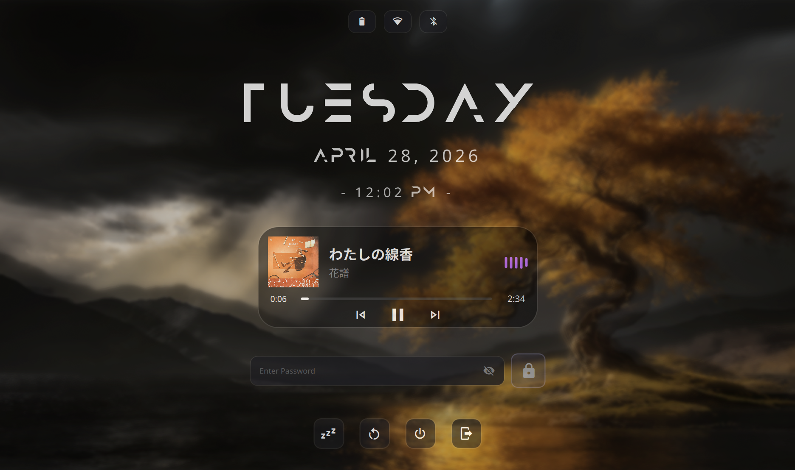

# Lockscreen

A minimalist, lockscreen written in  [Quickshell](https://quickshell.org/) for my Hyprland workspace.

## Preview


## Installation

### 1. Clone the Repository

Clone this repository into your Quickshell configuration directory:

```bash
mkdir -p ~/.config/quickshell
git clone https://github.com/notsopreety/lockscreen ~/.config/quickshell/lockscreen
```

### 2. Install the Font

This lockscreen uses the **Anurati** font.

1. Download the font: [Anurati Font](https://font.download/dl/font/anurati.zip)
2. Extract and install:

```bash
unzip ~/Downloads/anurati.zip
mkdir -p ~/.local/share/fonts
mv ~/Downloads/Anurati-Regular.otf ~/.local/share/fonts/
fc-cache -fv
```

> **Note:**  Make sure replace the wallpaper path in `LockSurface.qml`.

## Usage

Run the lockscreen with the following command:

```bash
QML2_IMPORT_PATH=~/.config/quickshell/lockscreen quickshell -p ~/.config/quickshell/lockscreen/shell.qml
```

## Features

- Media player integration (MPRIS)
- Status indicators (Battery, Wi-Fi, Bluetooth)
- Smooth transitions and animations

> **TIP**: Set keybindings of lockscreen in yourhyprland config for easy access.

> `bind = SUPER SHIFT, L, exec, QML2_IMPORT_PATH=~/.config/quickshell/lockscreen quickshell -p ~/.config/quickshell/lockscreen/shell.qml`